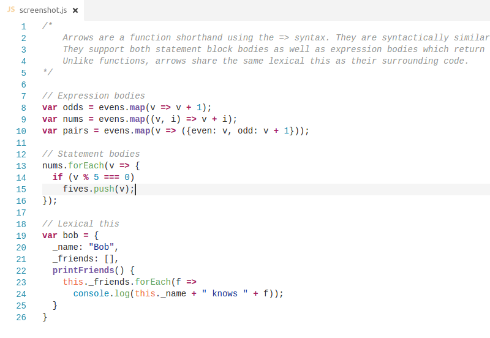

# GitHub Bold Theme

This repository should provide a light theme identical to GitHub (with bold keywords) for Visual Studio Code editor.

If you find any mismatch from GitHub, feel free to make a new Pull Request.

### Credits

* Theme is made with [tmTheme-editor](http://tmtheme-editor.herokuapp.com) from [aziz](https://github.com/aziz/tmTheme-Editor).
* It's based on [Inspiredgithub](http://tmtheme-editor.herokuapp.com/#!/editor/theme/Inspiredgithub).
* The icon used is the [Octobi Wan Catnobi](https://octodex.github.com/octobiwan) by [cameronmcefee](https://github.com/cameronmcefee).
